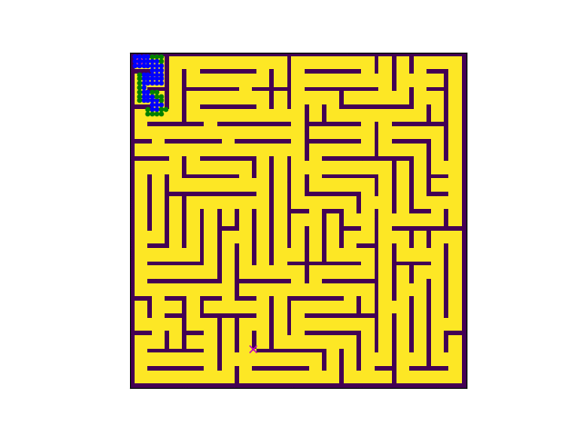

# A* Path Planning based Maze Solver

# Introduction
This code generates a randomized maze of a specified size and given the start and goal nodes solves the maze to generate a suboptimal path using A* algorithm. The code is written to assist understanding of use of python datastructure to reduce execution time to solve a popular path planning algorithm.

## Demo
Demo 1
- Grid Size - 77x77
- Start Node - 2,2
- End Node - 28,68


Demo 2
- Grid Size - 125x125
- Start Node - 2,2
- End Node - 58,110


# Algorithm - A* 
A* is like Dijkstra’s Algorithm in that it can be used to find a shortest path. A* is like Greedy Best-First-Search in that it can use a heuristic to guide itself.

The secret to its success is that it combines the pieces of information that Dijkstra’s Algorithm uses (favoring vertices that are close to the starting point) and information that Greedy Best-First-Search uses (favoring vertices that are close to the goal). In the standard terminology used when talking about A*, g(n) represents the exact cost of the path from the starting point to any vertex n, and h(n) represents the heuristic estimated cost from vertex n to the goal. In the above diagrams, the yellow (h) represents vertices far from the goal and teal (g) represents vertices far from the starting point. A* balances the two as it moves from the starting point to the goal. Each time through the main loop, it examines the vertex n that has the lowest f(n) = g(n) + h(n).

credits: http://theory.stanford.edu/~amitp/GameProgramming/AStarComparison
``` Python
function reconstruct_path(cameFrom, current)
    total_path := {current}
    while current in cameFrom.Keys:
        current := cameFrom[current]
        total_path.prepend(current)
    return total_path

# A* finds a path from start to goal.
# h is the heuristic function. h(n) estimates the cost to reach goal from node n.
function A_Star(start, goal, h)
    """ The set of discovered nodes that may need to be (re-)expanded.
     Initially, only the start node is known.
     This is usually implemented as a min-heap or priority queue rather than a hash-set."""
    openSet := {start}

    # For node n, cameFrom[n] is the node immediately preceding it on the cheapest path from start
    # to n currently known.
    cameFrom := an empty map

    # For node n, gScore[n] is the cost of the cheapest path from start to n currently known.
    gScore := map with default value of Infinity
    gScore[start] := 0

    # For node n, fScore[n] := gScore[n] + h(n). fScore[n] represents our current best guess as to
    # how short a path from start to finish can be if it goes through n.
    fScore := map with default value of Infinity
    fScore[start] := h(start)

    while openSet is not empty
        #This operation can occur in O(1) time if openSet is a min-heap or a priority queue
        current := the node in openSet having the lowest fScore[] value
        if current = goal
            return reconstruct_path(cameFrom, current)

        openSet.Remove(current)
        for each neighbor of current
            # d(current,neighbor) is the weight of the edge from current to neighbor
            # tentative_gScore is the distance from start to the neighbor through current
            tentative_gScore := gScore[current] + d(current, neighbor)
            if tentative_gScore < gScore[neighbor]
                // This path to neighbor is better than any previous one. Record it!
                cameFrom[neighbor] := current
                gScore[neighbor] := tentative_gScore
                fScore[neighbor] := gScore[neighbor] + h(neighbor)
                if neighbor not in openSet
                    openSet.add(neighbor)

    # Open set is empty but goal was never reached
    return failure
   ```
   
## Getting Started

These instructions will get you a copy of the project up and running on your local machine for development and testing purposes. 

### Prerequisites

- Python 3.x
- Numpy
- sympy
- matplotlib


## Versioning
- 1.0
    - First Release
    - Future Releases intends to improver performance


## Authors

* **Subhransu Mahapatra** 


 
